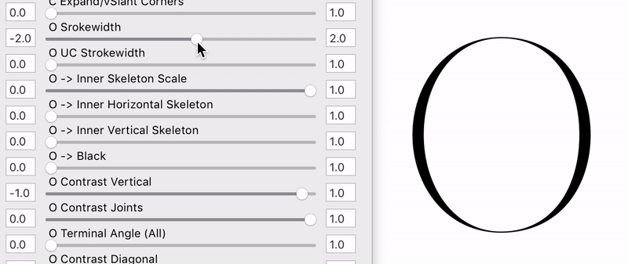
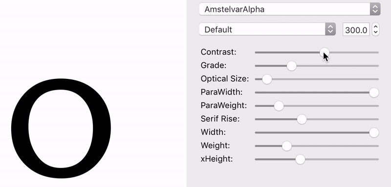

# Experimental Parametric Typeface
This experimental design (*early 2014) uses only drawn outlines and interpolation calculations, very similar to the new variable font format. Except it allows to use simple math to manipulate the communication between the different axes as the following example shows.

### Controlled behaviour, supplied by the type designer  
  
  
(ContrastMaster = WeightSlider * SliderContrast;)

### Independent behaviour, vff-spec 2017

In the current spec of the variable font format the designer can not yet specify the relation between the axes. Problem: Contrast ratio changes while adjusting weight, ande vice versa. (Example: Amstelvar)

----

  
https://vimeo.com/118806744

**Use**
1. copy .py File to Glyphs script folder
2. Open .Glyphs file
3. Run “Parametric Typeface AAVT-MM-Outline”
4. Have Fun 
  
  
   
   
**Trouble shooting**
- this version only works in Glyphs 2.0 (although since 2.0 the spacing axis is not working anymore)
- make sure the “Vanilla” is installed (go to Glyphs > Preferences > Addons > Modules and click the Install Modules button)
- if the sliders wont show up again, try to remove the all the current instances

**Rights**
- Attribution only. [CC-BY-2.0](https://creativecommons.org/licenses/by/2.0/)
